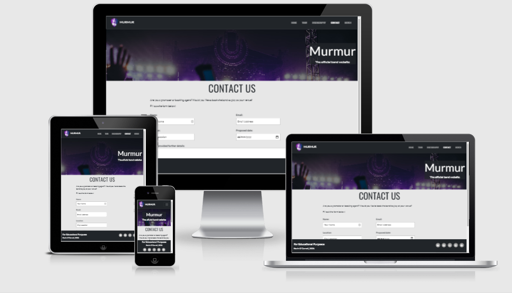

# Murmur - The official band website.

## Project Goals

A promotional website for the band Murmur. The site aims to be a one-stop shop for all things related to the band, featuring band news, a catalogue of their discography, a list of tour dates, a contact page, and links to the band’s merch store. The primary goals of the site are to keep new and returning visitors updated, to generate bookings via the contact form, and to generate revenue via ticket sales and by directing potential customers to the merch store.

The business goals of the site are to:
-	Increase awareness of the band/brand.
-	Generate bookings.
-	Generate revenue from tickets and merchandising.

The user goals are to:
-	Check for news about the band.
-	Find out about the band’s back catalogue.
-	Check tour dates & purchase tickets.
-   Book the band for shows.
-	Buy merchandise.

 
## UX
 
### User Stories:
1.	As a new user, I want the site to be easy to navigate, so that I can find my way around without difficulty.
2.	As a new user, I want to find out more about the band, so that I can feel connected to them.
3.	As a fan, I want to be able to explore the band’s back catalogue, so that I can find out about previous releases.
4.	As a fan, I want to be able to see the locations and dates of all upcoming gigs, so that I don’t miss a show.
5.	As a fan, I want to be able to easily access the store, so that I can purchase merchandise.
6.	As a promoter, I want a straightforward contact form, so that I can enquire about booking the band for gigs.
7.	As an interested user (a fan or a promoter), I want to be able to access the band’s social media accounts and streaming platforms, so that I can find out more about them and listen to their music.

### Wireframes:
- [index.html](assets/wireframes/index.pdf)
- [tour.html](assets/wireframes/tour.pdf)
- [discography.html](assets/wireframes/discography.pdf)
- [contact.html](assets/wireframes/contact.pdf)

## Features
### Header:
- Each page features a header, consisting of a brand logo (which doubles as a link to the homepage) and a navbar which provides links to the site's other pages and to an external merch store.
- This header is responsive, and on smaller screen sizes collapses into a list that is toggled with a button. 

### Footer:
- Each page features a footer, consisting of copyright information in the bottom left, and links to the relevant social media sites in the right.
- This header is responsive, and on smaller screen sizes shifts to a centered alignment with the copyright information on top, and the social links below.

### Hero Image:
- Each page features a hero image, featuring an image of a live music performance and a jumbotron prominently displaying the band name.
- This image is intended to invoke the energy and spectacle of live music and utilizes a color palette that is consistent with the rest of the site.

### Home: 
- The home page consists of a series of news paragraphs from the band, providing updates to interested parties (fans or promoters) on topics like new releases and upcoming tour dates.
- Each news item is accompanied by an image depicting a live music event, featuring light shows or pyrotechnics. Again, these images are intended to elicit a positive response from the user by invoking the atmosphere of a gig or festival.
- On smaller screen sizes, these news items and images display as a list instead, separated by styled horizontal rules.

### Tour:
- The tour page consists of list of upcoming tour dates.
- Each tour item displays the date, city and venue for each gig, along with an anchor (styled as a button) that links out to a 3rd party ticket website.
- Below these tour items, there is a "Subscribe" button, accompanied by some text serving as a call to action.
- This button triggers a modal that displays over the whole page and consists of a form that asks users to provided their name and email address in order to subscribe to the mailing list.

### Discography:
- The discography page consists of the album artwork of all the band’s previous releases displayed with the alum title and release year in chronological order.
- On desktop/laptop screens, the album info will be concealed initially and revealed on mouse over, giving a sense of interactivity to the user's experience.

### Contact:
- The contact page consists of a form that allows any prospective booking agents or promoters to reach out to the band regarding potential shows.
- The form asks the user to provide a name, email address, a location (city/venue), and a proposed date. The form also contains a textarea which allows the user to freehand some text explaining their proposal.

### Defensive Design:
- The site utilizes Defensive Design principles to try to preserve the user's experience in the event that something goes wrong. 
- It does this by including a custom 404 error page, consisting of a brief piece of text explaining that there has been an error, and a link allowing the user to easily navigate back home.
- Additionally, the custom 404 page also contains the header and footer from the regular pages, allowing the user to navigate directly to any of the pages on the site, or to the associated social media links. 

### Features Left to Implement:
- Build a custom 500 error page, in the style of the 404 error as described above. - Backend required
- Fix the link to the newsletter on the home page, to link directly to the open modal - JavaScript required
- Connect the form elements to the backend by:
    - Utilizing the newsletter signup form on the modal to create a mailing list.
    - Emailing response on the contact form to the band's management.
- Implement an on-site storefront rather than linking out to a 3rd party site. - Backend required

## Technologies Used

- HTML5 - the pages of this site were designed using HTML.
- CSS3 - the pages of this site were styled using CSS.
- [Gitpod](https://www.gitpod.io/) - the site was developed using Gitpod as the development environment.
- [Bootstrap](https://getbootstrap.com/) - Bootstrap 5 was used to structure the layout of the site and make it responsive, as well as providing the JavaScript for the navbar and modal.
- [Font Awesome](https://fontawesome.com/) - Font Awesome icons were used for the social media links in the footer.
- [Google Fonts](https://fonts.google.com/) - Google Fonts were used throughout the project.
- [Hover.CSS](https://ianlunn.github.io/Hover/) - Hover.CSS was used to add hover effects to social media links in the footer and buttons throughout the site.
- [Logo Maker](https://www.freelogodesign.org/) - The site's brnad logo was created using this Logo Maker.
- [Favicon Generator](https://www.favicongenerator.com/) - Favicon Generator was used to create and size the favicon for the site, using the logo created above.
- [Squoosh](https://squoosh.app/) - All photos used on the site were compressed and resized using Squoosh.
- [Autoprefixer](https://autoprefixer.github.io/) - Autoprefixer was used to ensure cross browser support for the CSS code.

## Testing

### Validation:
- [W3C Markup Validation](https://validator.w3.org/) was used to validate the HTML used in this site.
    - The validator highlighted that some anchor elements had button elements nested within them. This was addressed by removing the button elements and styling the anchor elements to appear as buttons.
    - Subsequent validation did not highlight any issues.
- [Jigsaw/W3C CSS Validation](https://jigsaw.w3.org/css-validator/) was used to validate the site's CSS.
    - CSS was validated without issue before being run through Autoprefixer.
    - Subsequent validation has highlighted the vendor prefixes added by Autoprefixer, but no other issues.

### Automated Testing:
- Each page of the site was evaluated using [Lighthouse](https://developers.google.com/web/tools/lighthouse/) to assess them on four metrics; Performance, Accessibility, Best Practices & Search Engine Optimization (SEO).
- The following changes were implemented:
    - Best Practices:
        - The attribute `rel="noopener noreferrer"` was added to all links to external 3rd party sites as a security feature to protect against malicious phishing or 'tabnapping'.
    - Accessibility:
        - The attributes `aria-control` and `aria-label` were added to the button element in the navbar to improve accessibility by clearly indicating the element's purpose to screen readers and other assistive technologies.
        - Some `<h5>` and `<h6>` elements had been used non-sequentially, causing issues with the semantic flow of the page. These were changed to `
` elements and re-styled in CSS.
        - The font color used on some of the anchor elements was flagged as being too light, and not sufficiently contrasted against the background color. These were re-styled to override the colors provided by Bootstrap.
    - Search Engine Optimization:
        - To improve SEO, a `<meta name="description">` tag was added to the head of each page, with content describing the page and its purpose.

### Testing User Stories:
1.	As a new user, I want the site to be easy to navigate, so that I can find my way around without difficulty.
    - The navbar is prominently displayed in the top right across the site, allowing the user to navigate to and from all pages of the site with ease. On mobile, the navigation links are displayed in a list, toggled by a hamburger icon.
    - The brand logo in the top left of the header serves as a link that allows a user to navigate to the homepage from anywhere on the site.
2.	As a new user, I want to find out more about the band, so that I can feel connected to them.
    - All latest updates regarding the band are displayed in the news section on the homepage and are the first thing a new user would see on arriving on the site.
    - The copy in this news section directs the user to then explore further, providing prompts and links to the Discography and Tour pages.
    - The Tour page includes a form (on a modal) that allows users who wish to know more to sign up for the mailing list.
    - The band's social media accounts and streaming profiles are linked in the footer of every page and are labelled with recognizable icons (courtesy of Font Awesome).
3.	As a fan, I want to be able to explore the band’s back catalogue, so that I can find out about previous releases.
    - The site features a dedicated Discography page, which contains the album artwork and release information for all the bands previous records.
    - The Discography page is accessible from any page on the site via the navbar, and the copy on the home page also directs the user there.
4.	As a fan, I want to be able to see the locations and dates of all upcoming gigs, so that I don’t miss a show.
    - The site features a dedicated Tour page, which displays the band’s upcoming tour dates, locations and venues, along with links to an external ticketing site to allow users to purchase tickets.
    - The Tour page includes a form (on a modal) that allows users to sign up for the mailing list to be notified of future tour dates.
5.	As a fan, I want to be able to easily access the store, so that I can purchase merchandise.
    - The external merch store is accessible from every page on the site via a link in the navbar.
6.	As a promoter, I want a straightforward contact form, so that I can enquire about booking the band for gigs.
    - The site features a Contact page, consisting of a straightforward form that allows promoters to enquire about the band's availablity. 
    - The form asks the user to provide a name and email address, along with a prospective venue/location and date. It also includes a textarea that allows the user to freehand some text to explain their proposal.
7.	As an interested user (a fan or a promoter), I want to be able to access the band’s social media accounts and streaming platforms, so that I can find out more about them and listen to their music.
    - As above, the band's social media accounts and streaming profiles are linked in the footer of every page and are labelled with recognizable icons (courtesy of Font Awesome).

### Manual Testing:
#### General
- Navbar
    - Opened page on laptop, desktop, mobile and tablet to ensure navbar displayed correctly at all screen sizes, as a vertical list on mobile screens and a horizontal list on larger screens.
    - Checked that the vertical list on mobile screens is toggled by a hamburger icon and hidden when not in use.
    - Checked that the navbar was positioned correctly; fixed to the top of the screen.
    - Checked that each link navigates to the correct page of the site.
    - Checked that the "Merch" navigation item, which links to an external site, opened in a new tab.
    - Checked that the Bootstrap hover effect for each navigation item works correctly, fading in on mouse over, and fading out on mouse out.
    - Checked that the link to the current page is always highlighted correctly.
    - Checked that the brand logo links back to the Home page.
    - These Testing steps were repeated for each page on the site.
 
 - Footer
    - Opened page on laptop, desktop, mobile and tablet to ensure the footer displayed correctly at all screen sizes; center aligned on mobile with the copyright info on top of the social media links, and with social media icons aligned to the right and copyright info aligned to the left on larger screens.
    - Checked that social media links were displaying correctly, with relevant Font Awesome icons.
    - Checked that the social media links were pointed correctly, and all opened in new tabs.
    - Checked that the customized hover effect (based on Hover.CSS) functioned correctly on the social media links; changing the background color and font color on mouse over and reverting on mouse out.
    - These Testing steps were repeated for each page on the site.

- Hero Image & Title Card
    - Opened page on laptop, desktop, mobile and tablet to ensure that the hero image is visible and positioned correctly.
    - Checked that the opaque overlay is positioned over the image as a filter.
    - Checked that the title card displays correctly, center aligned on mobile screens and right aligned on larger screen sizes.
    - Checked that the z-index is correctly displaying the stack of elements, from bottom to top: the hero image, the opaque overlay, the semi-opaque title card, and the title text.
    - These Testing steps were repeated for each page on the site.

#### Home Page
- Checked to ensure that content of the home page was displaying correctly.
- On larger screens checked that the news items display as text on the left and images on the right, separated by a vertical border.
- On mobile screens, checked that the Bootstrap "order" classes functioned correctly, and the news items displayed as images on top and text below, and were separated from each other by custom styled horizontal rules.
- Checked that text was legible and the images were clearly visible.
- Checked the above on laptop, desktop, mobile and tablet, and by dragging the borders of the browser window to resize.

*A screenshot of the Home page (index.html) as viewed on different screen sizes, generated on [ami.responsivedesign.is](http://ami.responsivedesign.is/). An interactive scrollable version is available [here](http://ami.responsivedesign.is/?url=https://kevinoc554.github.io/murmur-bandsite/index.html).*

#### Tour
- Checked to ensure the Tour items displayed correctly.
- On larger screens, checked that the venue, location and tickets link were spread out on one bootstrap row.
- On mobile screens, checked that the Bootstrap "order" classes functioned correctly, and the date, venue and location were all stacked vertically on the left, with the tickets button on the right.
- Checked that the customized hover effect (based on Hover.CSS) functioned correctly on the Tickets links and Subscribe button; changing the background color and font color on mouse over and reverting on mouse out.
- Checked that the modal opened correctly when the Subscribe button is clicked.
- Checked that the modal appears correctly stled and positioned, and the input fields are correctly sized.
- Attempted to submit an empty form, and then again with some text in the "Name" to confirm that the inputs have the `required` attribute, and the appropriate error message shows.
- Attempted to submit the form with an invalid email address to confirm that the appropriate error message shows.
- Attempted to submit the form correctly filled out to check that the inputs would be accepted.
- Checked the above on laptop, desktop, mobile and tablet, and by dragging the borders of the browser window to resize.

*A screenshot of the Tour page (tour.html) as viewed on different screen sizes, generated on [ami.responsivedesign.is](http://ami.responsivedesign.is). An interactive scrollable version is available [here](http://ami.responsivedesign.is/?url=https://kevinoc554.github.io/murmur-bandsite/tour.html).*

#### Discography
- Checked to ensure the album artworks displayed correctly; as three columns on desktop and laptop, two columns on tablets and a single column on mobile.
- Checked that the album info displays correctly on mobile and tablet as center aligned text over the images.
- Checked that the hover effect that causes the album artwork to become opaque and reveal the album information works correctly, and doesn't effect mobile views.
    - *Testing showed that while the text was appearing correctly, the hover effect could still be triggered on mobile. Bug fix outlined below.*

*A screenshot of the Discography page (discography.html) as viewed on different screen sizes, generated on [ami.responsivedesign.is](http://ami.responsivedesign.is). An interactive scrollable version is available [here](http://ami.responsivedesign.is/?url=https://kevinoc554.github.io/murmur-bandsite/discography.html).*

#### Contact
- Checked that the form displays correctly on different screen sizes.
- Checked that the customized hover effect (based on Hover.CSS) functioned correctly on the Submit button; changing the background color and font color on mouse over and reverting on mouse out.
- Repeated the form submission steps outline in the **Tour** section above, checking that the form will not submit without the required inputs and that the email input is validated.

*A screenshot of the Contact page (contact.html) as viewed on different screen sizes, generated on [ami.responsivedesign.is](http://ami.responsivedesign.is). An interactive scrollable version is available [here](http://ami.responsivedesign.is/?url=https://kevinoc554.github.io/murmur-bandsite/contact.html).*

#### 404 Error

### Bugs:
- Navbar and footer were not scrolling with the screen.
    - Fixed by setting `position: fixed;`
- Some elements, inculding Navbar when scrolling, were appearing under the opaque filter on the hero image.
    - Fixed by setting the z-index of all elements involved, so they appear stacked correctly,
- Hover effect on album images on discography.html that were intended for desktop and laptop only, were also triggering on smaller screens.
    - Fixed by moving relevant CSS to a media query that only triggers above tablet screen sizes.

## Deployment

- This site was developed in [Gitpod](https://www.gitpod.io/), commited and pushed to [Github](https://github.com/), and deployed on [GitHub Pages](https://pages.github.com/).
- At the time of submission, there are no differences between the development version and deployed version of the site.

### The following steps were taken to deploy this site:
- Logged in to Github, and navigated to the site's **[repository](https://github.com/kevinoc554/murmur-bandsite)**.
- Clicked on **Settings** in the toolbar near the top of the screen.
- Scrolled down to the **GitHub Pages** section of the **Settings** page.
- Under the **Source** heading, clicked on the **Branch** dropdown, and selected **Master**.
- Clicked on **Save**, deploying the site.
- Clicked on the URL at the top of the **GitHub Pages** section to navigate to the live site.
- *More info on deploying to **GitHub Pages** can be found [here](https://docs.github.com/en/github/working-with-github-pages/creating-a-github-pages-site#creating-your-site).*

### To run and edit the code for this site locally, follow these steps:
* Log in to GitHub, and navigate to the site's **[repository](https://github.com/kevinoc554/murmur-bandsite)**.
* Click on the green **Code** button.
* Copy the URL under **Clone with HTTPS** by clicking on the **Copy** button.
* Open the terminal in your IDE, and navigate to the desired directory.
* Type `git clone` into the terminal, and paste in the copied URL, e.g.,  
``console git clone https://github.com/kevinoc554/murmur-bandsite.git``
* Press enter to clone the repository.
* *More info on cloning a **GitHub** repository can be found [here](https://docs.github.com/en/github/creating-cloning-and-archiving-repositories/cloning-a-repository).*

## Credits

### Content
- As Murmur are a fictious band, all copy was written by the developer.

### Media
- Photo Credits:
    - Hero Image:
        1. Photo by [Hanny Naibaho](https://unsplash.com/@hannynaibaho?utm_source=unsplash&utm_medium=referral&utm_content=creditCopyText) on [Unsplash](https://unsplash.com//s/photos/live-music?utm_source=unsplash&utm_medium=referral&utm_content=creditCopyText)

    - Home Page:
        1. Photo by [David Menidrey](https://unsplash.com/@cazault?utm_source=unsplash&amp;utm_medium=referral&amp;utm_content=creditCopyText) on [Unsplash](https://unsplash.com//s/photos/live-music?utm_source=unsplash&utm_medium=referral&utm_content=creditCopyText)
        2. Photo by [Alejandro Ortiz](https://unsplash.com/@aljandro?utm_source=unsplash&utm_medium=referral&utm_content=creditCopyText) on [Unsplash](https://unsplash.com//s/photos/live-music?utm_source=unsplash&utm_medium=referral&utm_content=creditCopyText)
        3. Photo by [William Hook](https://unsplash.com/@williamtm?utm_source=unsplash&utm_medium=referral&utm_content=creditCopyText) on [Unsplash](https://unsplash.com//s/photos/live-music?utm_source=unsplash&utm_medium=referral&utm_content=creditCopyText)

    - Discography:
        1. Photo by [Christina Deravedisian](https://unsplash.com/@92designed?utm_source=unsplash&amp;utm_medium=referral&amp;utm_content=creditCopyText) on [Unsplash](https://unsplash.com/s/photos/album-art?utm_source=unsplash&amp;utm_medium=referral&amp;utm_content=creditCopyText)
        2. Photo by [Efe Kurnaz](https://unsplash.com/@efekurnaz?utm_source=unsplash&amp;utm_medium=referral&amp;utm_content=creditCopyText) on [Unsplash](https://unsplash.com/s/photos/album-art?utm_source=unsplash&amp;utm_medium=referral&amp;utm_content=creditCopyText)
        3. Photo by [Laura Vinck](https://unsplash.com/@lauravinck?utm_source=unsplash&amp;utm_medium=referral&amp;utm_content=creditCopyText) on [Unsplash](https://unsplash.com/s/photos/album-art?utm_source=unsplash&amp;utm_medium=referral&amp;utm_content=creditCopyText)
        4. Photo by [Ian](https://unsplash.com/@greystorm?utm_source=unsplash&amp;utm_medium=referral&amp;utm_content=creditCopyText) on [Unsplash](https://unsplash.com/s/photos/album-art?utm_source=unsplash&amp;utm_medium=referral&amp;utm_content=creditCopyText)
        5. Photo by [Isi Parente](https://unsplash.com/@isiparente?utm_source=unsplash&amp;utm_medium=referral&amp;utm_content=creditCopyText) on [Unsplash](https://unsplash.com/s/photos/album-art?utm_source=unsplash&amp;utm_medium=referral&amp;utm_content=creditCopyText)
        6. Photo by [Jaclyn Moy](https://unsplash.com/@jelizabm?utm_source=unsplash&amp;utm_medium=referral&amp;utm_content=creditCopyText) on [Unsplash](https://unsplash.com/s/photos/album-art?utm_source=unsplash&amp;utm_medium=referral&amp;utm_content=creditCopyText)

### Acknowledgements
- I'd like to thank my mentor, Jack Wachira, for his support and guidance throughout this project.